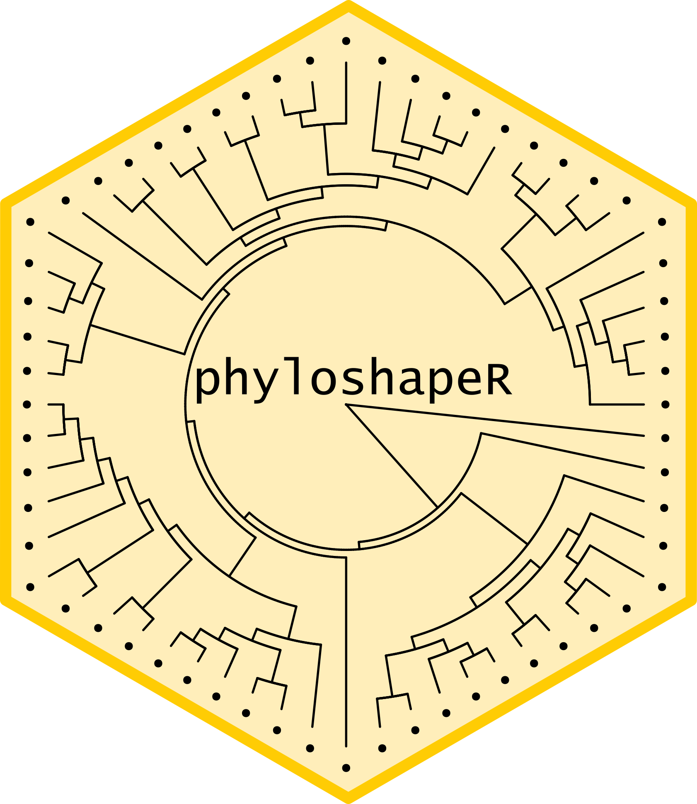

<!-- README.md is generated from README.Rmd. Please edit that file -->

# phyloshapeR

<!-- badges: start -->

[](https://github.com/iramosgutierrez/phyloshapeR/actions/workflows/R-CMD-check.yaml)
[](https://lifecycle.r-lib.org/articles/stages.html#stable)
[](https://www.repostatus.org/#active)
[](http://hits.dwyl.com/iramosgutierrez/phyloshapeR)
[](http://hits.dwyl.com/iramosgutierrez/phyloshapeR)
<!-- badges: end -->



`phyloshapeR` is a package to plot phylogenies in a custom shape

## 1. Getting started

To install **phyloshapeR** from GitHub, you might need to install the
*devtools* package. Once you have it, you just have to specify the
repository and install!

``` r
# install.packages("devtools")
devtools::install_github("iramosgutierrez/phyloshapeR")
library("phyloshapeR")
```

If you want to clone the repository, you can find the code
[here](https://github.com/iramosgutierrez/phyloshapeR).

### 1.1 The phyloshapeR package

The aim of this package is to create visual plots of phylogenies, but
never to create phylogenetic trees to be used for analyses. The workflow
of this package is to use an existing phylogenetic tree (or create a new
one) and modify its branch lengths to match a particular shape.
Originally it was designed to be used with administrative boundaries. It
must be noted that depending on the contour of the desired shape,
results may vary (more or less rounded shapes work better than long
ones). However, several predefined shapes (as diamond, heart, star or
polygons) have been added too.

### 1.2 Preparing the data

The only files we need to use `pyloshapeR` are a shapefile (spatial
vector) and a phylogenetic tree. However, both of them can be loaded or
created internally.

#### Loading an own shapefile

Shapefiles are spatial vectors that must be loaded using the `terra`
package.

``` r
library(terra)
shape <- terra::vect("files/country_boundary.shp")
```

In case we lack a shapefile including the geometries we want to use, we
can use a predefined map loaded in `phyloshapeR`. However, we must do
some post-processing to select the corect geomentries, as unique
countries have several polygons.

``` r

shape <- terra::vect(phyloshapeR::world)
shape <- shape[shape$name=="Australia",] #We select all the territories from Australia's country
shape <- get_territory(shape, order = 1) #we select the biggest one  (mainland Australia)
```

In case you don’t want to shape your phylogeny using a country border,
but want to use a predefined form, you can alternatively use function
`getshape` (see below).

#### Loading an own phylogeny

In case you want to use a specific tree to be plotted, it must be loaded
using `ape's` package `read.tree` function.

``` r
library(ape)
tree <- ape::read.tree("example_tree.tre")
```

Keep in mind that this tree, if has too many tips may be pruned
afterwords (i.e. some of the tips may be randomly eliminated). In case
you want to use the complete tree, you will have to specify in the
function afterwords to use the same tips for the shape as your tree has!

## 2. phyloshapeR functions

### getshape() function

This function is needed only if you don’t have an own shapefile to be
used and want to plot a phylogeny using some predefined forms. The
options to be selected (i.e. the `type` argument) are diamond, star,
heart, or a polygon of the desired number of sides (to be specified in
the `sides` argument). Additionally, you can rotate the output shape
using the `rotate` argument, specifying a number of degrees to rotate in
a counter-clockwise direction.

``` r
heart <- getshape(type="heart")
star <- getshape(type="star")
hexagon <- getshape(type="polygon", sides = 6)
rot.hexagon <- getshape(type="polygon", sides = 6, rotate = 30)

par(mfrow=c(2,2))
terra::plot(heart, main="Heart")
terra::plot(star, main="Star")
terra::plot(hexagon, main="Hexagon")
terra::plot(rot.hexagon, main="Rotated Hexagon")
```


In case you alternatively want to use a country border to shape your
phylogeny, you might use the world map included in phyloshapeR. However,
as most have more than one geometry (due to islands or other
administrative separations), we have to select which geometry we want to
use. This can be done manually, selecting the geometry we want to use
one by one, or selecting the one with the biggest expanse (which is
generally in the one of interest) using the accessory function
`get_territory`.

``` r

world <- terra::vect(phyloshapeR::world)
australia <- world[world$name=="Australia",] #We select all the territories from Australia's country
mainland.aus <- get_territory(australia, 1) #we select the biggest one  (mainland Australia)
tasmania <- get_territory(australia, 2) #we select the second biggest one  (Tasmania)


terra::plot(australia, col="red")
terra::plot(mainland.aus, col="green", add=T)
terra::plot(tasmania, col="blue", add=T)
legend("topright", legend=c("Mainland Australia", "Tasmania", "Not Selected"), fill=c("green", "blue", "red"))
```

 Bear
in mind that depending on the selected shape the results may vary. Using
very linear shapes (as the border of Chile, for example), or borders
with bends and turns (as the case of Great Britain) may result in
strange outputs.

### phyloshape() function

Once we have our shape loaded or created, and optionally the
phylogenetic tree to use, we have to calculate distances of the branches
to plot afterwards. In case the tree is not specified, a random phylogen
will be created, using the number of tips specified in parameter
`ntips`. If a tree is specified, and has more tips than the specified,
some of them will be randomply pruned to match the specified argument
value.

There are different approaches to the calculation of branch lengths,
which are specified in parameter `method`. Method “extend” will use the
internal branch length values, and extend the length just in the
branches over the tips. Contrarily, method “fill” (default) will
re-calculate internal branch lengths. To do so, it sets the splitting
point within nodes at a depth specified in argument `depth`. Values near
to 1 will result in very long internal branches, splitting nnear the
tips, while values near to 0 ill split near the root.

``` r

ext.tree  <- phyloshape(mainland.aus, exampletree, ntips =120, method = "extend")
fill.tree <- phyloshape(mainland.aus, exampletree, ntips=120, method = "fill")

par(mfrow=c(1,2), mar=c(1,0,1,0))
ape::plot.phylo(ext.tree,  type = "f", show.tip.label = F, edge.width = 0.75,main="Extend Method")
ape::plot.phylo(fill.tree, type = "f", show.tip.label = F, edge.width = 0.75,main="Fill Method")
```


``` r

depth.025.tree <- phyloshape(mainland.aus, exampletree, ntips=120, depth.k = 0.25)
depth.099.tree <- phyloshape(mainland.aus, exampletree, ntips=120, depth.k = 0.99)

par(mfrow=c(1,2), mar=c(1,0,1,0))
ape::plot.phylo(depth.025.tree,  type = "f", show.tip.label = F, edge.width = 0.75,main="depth.k = 0.25")
ape::plot.phylo(depth.099.tree, type = "f", show.tip.label = F, edge.width = 0.75, main="depth.k = 0.99")
```


Ultimately, we can select the coordinates where we want to set the root
of our tree, specifying a Spatial Vector point in the `point` argument,
using the auxiliar `coords_to_point()` function. It must be noted that
the specified point must be included within the shape extent. The
default value to use (if `point` is not specified) will be the centroid
of the geometry.

``` r

point1 <- coords_to_point(x=125, y= -22)
point2 <- coords_to_point(x=145, y= -28)


centroid.tree <- phyloshape(mainland.aus, exampletree, ntips=120)
point1.tree <- phyloshape(mainland.aus, exampletree, ntips=120,  point = point1)
point2.tree <- phyloshape(mainland.aus, exampletree, ntips=120,  point = point2)

par(mfrow=c(1,3), mar=c(10,0,10,0))
ape::plot.phylo(point1.tree,  type = "f", show.tip.label = F, edge.width = 0.75,   main="Custom west point")
ape::plot.phylo(centroid.tree, type = "f", show.tip.label = F, edge.width = 0.75, main="Centroid")
ape::plot.phylo(point2.tree,  type = "f", show.tip.label = F, edge.width = 0.75,   main="Custom east point")
```


### phylomap() function

The last function is a custom plot to be used with the results of
phyloshape() function. However, it is only a simplification of some
parameters of `ape's` `plot.phylo()` possibilities, proposed here. In
case you are familiar with phylogeny plotting, you may prefer to
custmize the parameters to your preferred options.

`phylomap()` has a set of editable parameters (`offset`, `cex`, `pch`,
`tip.label.col`) that will affect to the plotting of the tips as labels
(namely the distance from the tree, the character size, the character
used to plot them, and the colour). Additional parameters can be passed
through plot.phylo() function, always with the nomenclature used therein
(you can use `?ape::plot.phylo` to see the possibilities!).

``` r

par(mfrow=c(1,3), mar=c(10,0,10,0))
phylomap(centroid.tree, main="Default output")
phylomap(centroid.tree, offset = 0.5, cex = 0.5, pch="o", tip.label.col = "red", main ="Changing tip label options")
phylomap(centroid.tree, edge.width=2, edge.color="green", main ="Changing tree options")
```


## Citation


    To cite package 'phyloshapeR' in publications use:

      Ramos-Gutierrez I (2024). _phyloshapeR: plot phylogenies as maps_.
      <https://github.com/iramosgutierrez/phyloshapeR>.

    A BibTeX entry for LaTeX users is

      @Manual{,
        title = {phyloshapeR: plot phylogenies as maps},
        author = {Ignacio Ramos-Gutierrez},
        year = {2024},
        url = {https://github.com/iramosgutierrez/phyloshapeR},
      }
